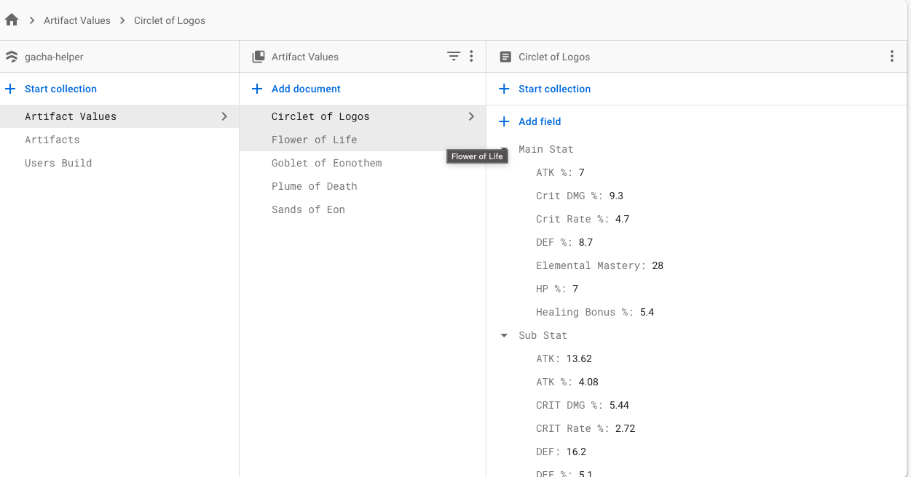

# gacha-helper

developers: 
* **Neha Choudhry**
* **Corey Edh**
* **Dhominic Abenes**
* **Sarah Dueltgen**

required software: 
* [x] Android Studio
* [x] Github
* [x] Firebase
* [x] Java

What is in the app:
* Homescreen
* Login and Sign Up
* Create Build
* Level Up
* Farm Artifact
* View Saved Artifact
* Recommended Builds

## How to download App and use it.
* First copy the git repo link
* Clone the git repo, if not familar Android Studios also allows you to put in clone repo
* Once the git repo is downloaded, open it in Android Studios
* Download a emulator if you don't already have one with API 30
* Click Run
* **Congrats!!** now you have a running Gacha-Helper App!

## Classes explain
* Login: Verify the user, uses firebase to authentic
* Sign Up: Gets user's information to register and make an account through firebase
* CreateBuild: This pulls data about artifacts and their stat chances, it uses this data to create the user a build
* FarmArtifact: This pulls data about each artifact and their stats, and runs calculations on how many resin (how many tries it has to loop through) to get the user's desire result
* RecyclerView: This is just to organize the list for FarmArtifacts
* UserBuild: is a custom object for User's Builds
* LevelUp: This feature should be able to pull a saved build from Firebase, and increase the level count by however many times the User clicks the level up button. 
* Saved Artifacts: This pulls saved builds and allows the user to view them by artifact type, including: plume, feather, sands of eon, goblet, and circlet.
* Recommended Builds: This feature serves as a guide for what artifacts the user should be looking for.

## How the Database Looks
### User Build in database

### Artifact in database

### Artifact Values in database

## Using the App
* Make an account with Sign Up, make sure the password is longer than 6 characters
and that you enter in a valid email
* If you already have an account, then press login and enter your login
* After you login/sign up you will be presented to the menu navigator, using this you can navigate to the following:
	* Farm Artifact
	* Create Build
	* View Saved Build
	* Level Up
	* Recommend
* Farm Artifact: this allows you to know how many Resin it takes to get an Artifact with a certain stat.
to use it. Press on the artifact you want to farm, then stats will show up to the right, press one of those stats (you will not get a visual that it's selected but it is selected. Then once you select you stat you press Farm button. This will run the calculations and you get to see the Resin amount above the button.
* Create Build: This allows you to create a build and upload to Firebase. Once you are on Create a build press the artifacts you want, the limit is 5. You get to see what Artifacts were selected and what stats were chosen with it above the create build. Once you select all the stats you want, you press create build this sends the build in firebase and stores it.
*Level Up: This will allow the User to pull a Saved Build from Firebase and increase an Artifact's level based on however many times the User chooses to level up. 
* Saved Artifact: By clicking on the spinner, the user can select which category of saved artifacts they'd like to view.
* Recommended: this feature server as a text guide to building characters, a handy source which allows the user to know which artifacts they should be looking for. To use it, the user only needs to scroll through the text.

## Walkthroughs

